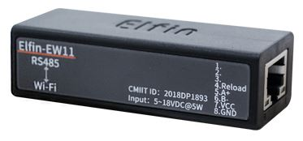

# Communication
This README is based on Google translations of documentation in a post by krzysztof1111111111 on https://www.elektroda.pl/rtvforum/topic3499254.html and the ZPS documentation in this repository. A big difference with the ZPS situation is that in a PCWU setup the heat pump and controller are already connected using RS485. Thus there are two modes of possible communication:

## Eavesdropping on the communication between the G-426 controller and the PCWU
Default communication parameters are 38400 8N1. A connection can be made by cutting wires between the controller and the heat pump and connecting a RS485 UART in parallel to the A and B lines. This was tested using an Elfin EW11 RS485 to Wi-Fi device which can be acquired for very little:

This device supports a wide range of voltages so the 12V + and - lines were also connected in parallel. If your RS485 device needs a different power source, simply don't cut the + and - lines or connect them back together to supply 12V to the G-426 controller.

The documentation for the protocol between the PCWU and the G-426 controller has been largely documented by krzysztof1111111111 in [Geco Proto.docx](Geco%20Proto.docx). This document has been Google translated from Polish to English.

This mode of communication is best suited to inspect and document the protocol spoken between the PCWU and G-426. It can also be used to 'overhear' relevant stats and use those in a 'read-only' fashion. For normal operation though it is probably better to use direct communication with the PCWU as described below. In theory it should also be possible to disconnect the G-426 and take over the communication with the PCWU entirely, but this has not been tested yet.

## Direct communication with the PCWU

TODO
